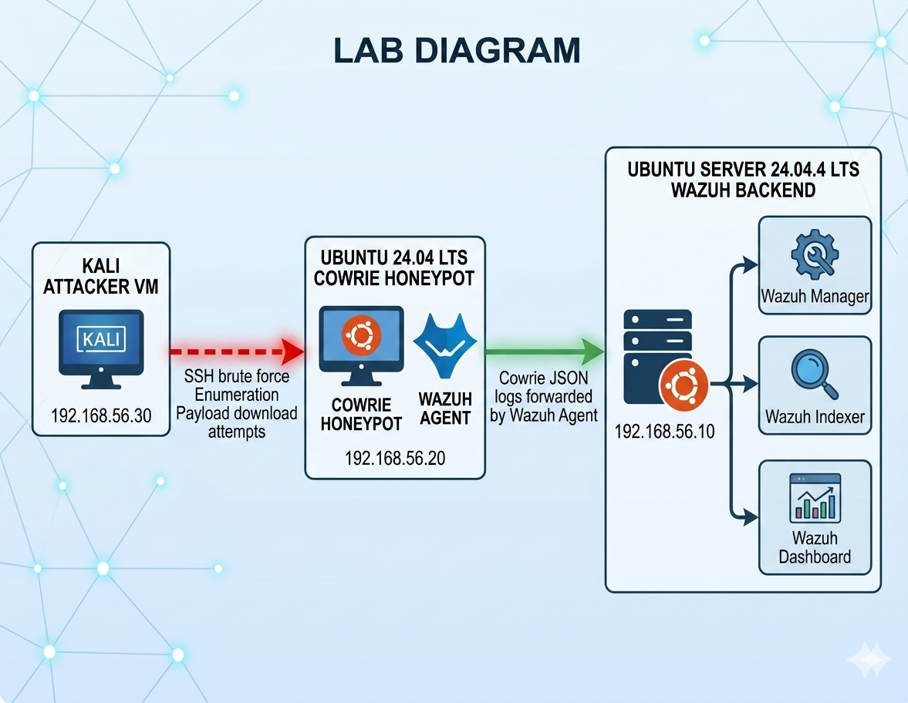

# Cowrie Honeypot with Wazuh SIEM Monitoring

## Overview
This project demonstrates a controlled SSH honeypot lab built with Cowrie, attack simulations from Kali Linux, production-style honeypot customization, and SIEM monitoring through Wazuh.

## Lab Components
- Kali Linux attacker VM
- Ubuntu Cowrie honeypot VM
- Wazuh SIEM server
- Wazuh agent installed on the Cowrie VM

## Lab Diagram

This lab uses three virtual machines on the `192.168.56.0/24` host-only network:

- **Wazuh Backend Server** — Ubuntu Server `24.04.4 LTS (Noble Numbat)`  
  IP: `192.168.56.10`

- **Cowrie Honeypot + Wazuh Agent** — Ubuntu VM `24.04 LTS`  
  IP: `192.168.56.20`

- **Kali Attacker VM**  
  IP: `192.168.56.30`
  

## Attack Scenarios Demonstrated
1. SSH brute-force attempts
2. Credential harvesting
3. Post-exploitation shell activity
4. Automated bot-style attack simulation
5. Malware download attempt simulation

## Cowrie Customization
The Cowrie environment was modified to resemble a production-style Linux server using customized fake filesystem contents and believable internal files.

## SIEM Integration
Cowrie JSON logs are forwarded to Wazuh using the Wazuh agent. Custom Wazuh rules detect:
- Failed login attempts
- Successful fake logins
- Suspicious shell commands
- Payload download attempts

## Repository Contents
- `configs/` — Cowrie and Wazuh configuration examples
- `attack-simulations/` — Lab-only attack scripts
- `logs/sanitized/` — Sanitized Cowrie JSON samples
- `docs/` — Setup and architecture notes
- `detections/` — Detection logic and rule explanations

